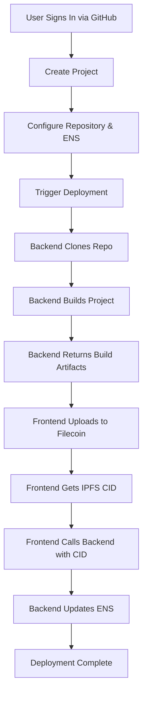

# Filify

**Filify** is a decentralized deployment platform that enables developers to deploy web applications to Filecoin storage and serve them via Ethereum Name Service (ENS) domains. Think of it as a Vercel-like platform for the decentralized web, combining GitHub integration, automated builds, Filecoin storage, and ENS publishing.

## Overview

Filify provides a complete workflow for deploying static web applications to the decentralized web:

1. **Connect GitHub** - Authenticate with GitHub OAuth to access your repositories
2. **Create Projects** - Link a GitHub repository, configure build settings, and set up ENS domain details
3. **Deploy** - Automatically clone, build, and upload your project to Filecoin
4. **Publish via ENS** - Update your ENS domain's contenthash to point to the IPFS CID

The platform consists of two main components:

- **Frontend**: React-based web application for managing projects and deployments
- **Backend**: Express.js API server handling authentication, builds, and ENS updates

## Key Features

### 🔐 Authentication & Security

- **GitHub OAuth Integration** - Secure authentication using GitHub accounts
- **Encrypted Storage** - All sensitive data (GitHub tokens, webhook secrets) are encrypted using AES-256-GCM
- **Session Management** - Secure session handling with SQLite-backed sessions
- **Rate Limiting** - API protection against abuse

### 📦 Project Management

- **Repository Integration** - Connect and manage GitHub repositories
- **Branch Selection** - Deploy from any branch in your repository
- **Build Configuration** - Customize build commands and output directories
- **Project History** - Track all deployments for each project

### 🚀 Automated Deployment

- **Smart Build Detection** - Automatically detects project type (Next.js, Vite, static sites, etc.)
- **Automatic Build Setup** - Configures Next.js static export when needed
- **Build Logs** - Real-time build logs and error tracking
- **Resume Capability** - Resume failed deployments from previous builds

### 🌐 Decentralized Storage & Publishing

- **Filecoin Upload** - Uploads build artifacts to Filecoin using `filecoin-pin`
- **IPFS Integration** - Content is accessible via IPFS network
- **ENS Updates** - Automatically updates ENS contenthash with IPFS CIDs
- **CID Tracking** - Monitor IPFS CIDs and verify ENS updates

### 📊 Deployment Tracking

- **Status Monitoring** - Real-time deployment status updates
- **Deployment History** - View all past deployments with status and timestamps
- **Error Handling** - Detailed error messages and recovery options
- **Transaction Tracking** - Monitor ENS update transactions on Ethereum

## Architecture

### System Flow



### Deployment Status Flow

```
cloning → building → uploading → awaiting_signature → awaiting_confirmation → success/failed
```

### Tech Stack

#### Frontend

- **Framework**: React 19 with TypeScript
- **Build Tool**: Vite
- **Routing**: React Router v7
- **UI Components**: Radix UI + Tailwind CSS
- **Filecoin Integration**: `filecoin-pin` library
- **HTTP Client**: Axios
- **Form Handling**: React Hook Form + Zod
- **Code Quality**: Biome (linting, formatting)

#### Backend

- **Runtime**: Node.js 18+
- **Framework**: Express.js
- **Language**: TypeScript
- **Database**: SQLite with Drizzle ORM
- **Authentication**: Passport.js (GitHub OAuth Strategy)
- **Session Management**: express-session with connect-sqlite3
- **GitHub API**: @octokit/rest
- **Blockchain**: ethers.js v6 for ENS updates
- **Encryption**: Node.js crypto module (AES-256-GCM)
- **Build Execution**: child_process
- **Validation**: Zod
- **Security**: helmet, cors, express-rate-limit

## Project Structure

```
filify/
├── frontend/                 # React frontend application
│   ├── src/
│   │   ├── components/      # React components
│   │   │   ├── auth/        # Authentication components
│   │   │   ├── deployments/ # Deployment UI components
│   │   │   ├── layout/      # Layout components
│   │   │   ├── navigation/  # Navigation components
│   │   │   ├── projects/    # Project management components
│   │   │   └── ui/          # Reusable UI components
│   │   ├── context/         # React context providers
│   │   ├── hooks/           # Custom React hooks
│   │   ├── lib/             # Library utilities
│   │   │   ├── filecoin-pin/ # Filecoin integration
│   │   │   └── local-storage/ # Local storage helpers
│   │   ├── pages/           # Page components
│   │   ├── routes/          # Route components
│   │   ├── services/        # API service layer
│   │   ├── types/           # TypeScript type definitions
│   │   └── utils/           # Utility functions
│   ├── public/              # Static assets
│   └── package.json
│
├── backend/                  # Express.js backend API
│   ├── src/
│   │   ├── config/          # Configuration files
│   │   │   ├── database.ts  # Database connection
│   │   │   ├── env.ts       # Environment validation
│   │   │   └── passport.ts  # Passport configuration
│   │   ├── controllers/     # Route controllers
│   │   │   ├── auth.controller.ts
│   │   │   ├── deployments.controller.ts
│   │   │   ├── projects.controller.ts
│   │   │   └── repositories.controller.ts
│   │   ├── db/              # Database schema and client
│   │   │   ├── index.ts     # Database client
│   │   │   └── schema.ts    # Drizzle schema definitions
│   │   ├── middleware/      # Express middleware
│   │   │   ├── auth.ts      # Authentication middleware
│   │   │   ├── errorHandler.ts
│   │   │   ├── rateLimiter.ts
│   │   │   └── validateRequest.ts
│   │   ├── routes/          # API route definitions
│   │   ├── services/        # Business logic services
│   │   │   ├── build.service.ts    # Build execution
│   │   │   ├── encryption.service.ts # Data encryption
│   │   │   ├── ens.service.ts      # ENS updates
│   │   │   └── github.service.ts   # GitHub API integration
│   │   ├── types/           # TypeScript type definitions
│   │   ├── utils/           # Utility functions
│   │   └── server.ts        # Express app entry point
│   ├── drizzle/             # Database migrations
│   ├── data/                # SQLite database and sessions
│   └── package.json
│
└── builds/                   # Temporary build artifacts (gitignored)
```

## Database Schema

The application uses SQLite with the following main tables:

- **users**: GitHub OAuth user information and encrypted tokens
- **projects**: Deployment project configurations (repo, ENS, build settings)
- **deployments**: Deployment records with status, logs, IPFS CIDs, and transaction hashes

## Getting Started

### Prerequisites

- Node.js 18.0 or higher
- npm 9+ (bundled with Node)
- GitHub OAuth App credentials
- ENS domain
- Filecoin wallet credentials (for filecoin-pin)

### Installation

1. **Clone the repository**:

    ```bash
    git clone <repository-url>
    cd filify
    ```

2. **Install frontend dependencies**:

    ```bash
    cd frontend
    npm install
    ```

3. **Install backend dependencies**:
    ```bash
    cd ../backend
    npm install
    ```

### Configuration

#### Frontend Configuration

Create a `.env` file in the `frontend/` directory:

```env
VITE_API_URL=http://localhost:3000
VITE_WALLET_ADDRESS=your_filecoin_wallet_address
VITE_SESSION_KEY=your_session_key
```

See `frontend/ENV.md` for detailed environment variable documentation.

#### Backend Configuration

Create a `.env` file in the `backend/` directory:

```env
# Server
PORT=3000
NODE_ENV=development
FRONTEND_URL=http://localhost:5173
BACKEND_URL=http://localhost:3000

# Database
DATABASE_URL=sqlite:./data/dev.db

# Session
SESSION_SECRET=generate_with_openssl_rand_base64_32

# Encryption
ENCRYPTION_KEY=generate_with_openssl_rand_hex_32_must_be_64_chars

# GitHub OAuth
GITHUB_CLIENT_ID=your_github_client_id
GITHUB_CLIENT_SECRET=your_github_client_secret
```

**Generate secrets**:

```bash
# Generate SESSION_SECRET
openssl rand -base64 32

# Generate ENCRYPTION_KEY (must be exactly 64 hex characters)
openssl rand -hex 32
```

**Convert GitHub App Private Key to base64**:

The `GITHUB_APP_PRIVATE_KEY` must be base64 encoded. Convert your PEM file:

```bash
# Output to terminal
cat /path/to/your-private-key.pem | base64 | tr -d '\n' && echo

# Or copy directly to clipboard (macOS)
cat /path/to/your-private-key.pem | base64 | tr -d '\n' | pbcopy
```

Copy the output and set it in your `.env`:

```env
GITHUB_APP_PRIVATE_KEY=LS0tLS1CRUdJTiBSU0EgUFJJVkFURSBLRVktLS0tLQo...
```

**Create GitHub App**:

1. Go to [GitHub Apps Settings](https://github.com/settings/apps/new)
2. Set the following:
   - **App name**: Your app name (e.g., `filify-dev`)
   - **Homepage URL**: `http://localhost:5173`
   - **Callback URL**: `http://localhost:3000/api/github/callback`
   - **Setup URL**: `http://localhost:3000/api/github/callback` (check "Redirect on update")
   - **Webhook**: Disable or set URL to `http://localhost:3000/api/github/webhook`
   - **Permissions**: 
     - Repository: Contents (Read), Metadata (Read)
     - Account: Email addresses (Read)
3. After creation, note down:
   - **App ID** → `GITHUB_APP_ID`
   - **App Name** (slug) → `GITHUB_APP_NAME`
   - **Client ID** → `GITHUB_APP_CLIENT_ID`
   - **Client Secret** → `GITHUB_APP_CLIENT_SECRET`
4. Generate a private key and convert to base64 (see above) → `GITHUB_APP_PRIVATE_KEY`

See `backend/ENV.md` for detailed environment variable documentation.

### Database Setup

1. **Generate database migrations**:

    ```bash
    cd backend
    npm run db:generate
    ```

2. **Run migrations**:
    ```bash
    npm run db:migrate
    ```

### Running the Application

1. **Start the backend server** (in `backend/` directory):

    ```bash
    npm run dev
    ```

    Server runs on `http://localhost:3000`

2. **Start the frontend dev server** (in `frontend/` directory):

    ```bash
    npm run dev
    ```

    Frontend runs on `http://localhost:5173`

3. **Open your browser**:
   Navigate to `http://localhost:5173`

## Usage

### Creating a Project

1. **Sign in** with your GitHub account
2. **Create a new project** from the dashboard
3. **Select a repository** from your GitHub repositories
4. **Choose a branch** to deploy from
5. **Configure ENS details**:
    - Pick an ENS domain owned by your connected wallet (auto-populated list)
    - The wallet owner address is stored so future ENS transactions can be signed client-side
6. **Set build configuration** (optional):
    - Build command (default: `npm run build`)
    - Output directory (auto-detected if not specified)

### Deploying

1. **Navigate to your project** from the dashboard
2. **Click "Deploy now"** to start a new deployment
3. **Monitor progress**:

    - **Cloning**: Repository is being cloned
    - **Building**: Dependencies installed and project built
    - **Uploading**: Build artifacts uploaded to Filecoin
    - **Awaiting signature**: Wallet needs to sign the ENS resolver transaction
    - **Awaiting confirmation**: Ethereum confirmation pending
    - **Success**: Deployment complete and accessible via ENS

4. **View deployment details**:
    - Build logs
    - IPFS CID
    - ENS transaction hash
    - Deployment status

### Resuming Failed Deployments

If a deployment fails during the upload or ENS update phase, you can resume from the previous build:

- Check "Resume from last build" when deploying
- This reuses the previous build artifacts instead of rebuilding

## API Endpoints

### Authentication

- `GET /api/auth/github` - Initiate GitHub OAuth
- `GET /api/auth/github/callback` - OAuth callback handler
- `GET /api/auth/user` - Get current authenticated user
- `POST /api/auth/logout` - Logout user
- `GET /api/auth/status` - Check authentication status

### Projects

- `GET /api/projects` - List all user projects
- `POST /api/projects` - Create new project
- `GET /api/projects/:id` - Get single project details
- `PUT /api/projects/:id` - Update project
- `DELETE /api/projects/:id` - Delete project

### Repositories

- `GET /api/repositories` - Get user's GitHub repositories
- `GET /api/repositories/:owner/:repo/branches` - Get repository branches

### Deployments

- `POST /api/deployments` - Create new deployment (trigger build)
- `GET /api/deployments/:id` - Get deployment status
- `POST /api/deployments/:id/ens/prepare` - Prepare ENS resolver calldata after uploading to Filecoin
- `POST /api/deployments/:id/ens/confirm` - Confirm a signed ENS transaction hash and verify the resolver
- `GET /api/projects/:id/deployments` - List project deployments

## Security Considerations

### Current Implementation

- All sensitive data is encrypted using AES-256-GCM
- GitHub tokens never leave the backend and ENS transactions are always signed via the connected wallet
- Session cookies use httpOnly and secure flags
- CORS configured with frontend URL whitelist
- Rate limiting on all API routes
- User ownership verified before all operations
- Input validation with Zod schemas

### Production Recommendations

- Use Redis for session storage instead of SQLite
- Implement proper secret management (e.g., AWS Secrets Manager, HashiCorp Vault)
- Use HTTPS in production
- Implement proper logging and monitoring
- Add database backups
- Consider using a production-grade database (PostgreSQL)
- Implement proper error tracking (e.g., Sentry)

## Filecoin Integration

Filify uses the [`filecoin-pin`](https://github.com/filecoin-project/filecoin-pin) library to upload files to Filecoin. The integration includes:

- **CAR File Creation** - Automatically creates Content Addressed Archive files
- **Storage Provider Selection** - Selects appropriate Filecoin storage providers
- **Progress Tracking** - Monitors upload progress through each phase
- **IPNI Indexing** - Verifies CID indexing and advertising
- **Onchain Commitment** - Verifies proof of data possession (PDP)

**Note**: Currently runs on Filecoin Calibration testnet. See [filecoin-pin#45](https://github.com/filecoin-project/filecoin-pin/issues/45) for mainnet deployment tracking.

## Development

### Frontend Scripts

- `npm run dev` - Start development server
- `npm run build` - Build for production
- `npm run lint` - Check code quality
- `npm run lint:fix` - Fix linting issues
- `npm run typecheck` - Type check without emitting
- `npm run test` - Run tests

### Backend Scripts

- `npm run dev` - Start development server with hot reload
- `npm run build` - Compile TypeScript
- `npm run start` - Start production server
- `npm run db:generate` - Generate database migrations
- `npm run db:migrate` - Run database migrations
- `npm run db:studio` - Open Drizzle Studio (database GUI)
- `npm run lint` - Lint code
- `npm run format` - Format code

### Database Management

**View database**:

```bash
cd backend
npm run db:studio
```

**Create migration**:

```bash
npm run db:generate
```

**Apply migrations**:

```bash
npm run db:migrate
```

## Contributing

See individual README files for contribution guidelines:

- [Frontend Contributing Guide](frontend/CONTRIBUTING.md)
- [Backend Contributing Guide](backend/README.md)

## Status

⚠️ **Development Status**: This is an MVP (Minimum Viable Product) and is actively being developed. Some features may be incomplete or subject to change.

**Known Limitations**:

- Runs on Filecoin Calibration testnet (not mainnet)
- Session key-based authentication (not production-ready)
- SQLite database (consider PostgreSQL for production)
- No "bring your own wallet" support yet

## License

MIT

## Resources

- [Filecoin Pin Documentation](https://docs.filecoin.io/builder-cookbook/filecoin-pin)
- [filecoin-pin Repository](https://github.com/filecoin-project/filecoin-pin)
- [ENS Documentation](https://docs.ens.domains/)
- [Frontend README](frontend/README.md)
- [Backend README](backend/README.md)
