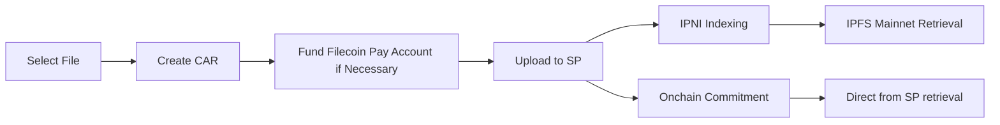

# Filecoin Pin Demo

A simple, easy-to-understand demo showing how to use [`filecoin-pin`](https://github.com/filecoin-project/filecoin-pin) to upload files to Filecoin. This single-page React + TypeScript app demonstrates the core upload workflow with progress tracking and wallet integration.

## Status

**⚠️ Not ready yet for production** - At least as of 2025-10-15, this Filecoin Pin demo dApp runs on Filecoin Calibration testnet only.  It's not ready for production use yet.  See:
- [filecoin-pin#45](https://github.com/filecoin-project/filecoin-pin/issues/45) for tracking when this will be publicly deployed to pin.filecoin.cloud.
- [filecoin-pin-website#77](https://github.com/filecoin-project/filecoin-pin-website/issues/77) for tracking "bring your own wallet" support.

## What This Demo Shows

This app demonstrates the complete `filecoin-pin` upload workflow:



- **Prepare** - Create CAR files from user files
- **Upload** - Execute upload to Filecoin Storage Provider (SP)
- **Index** - Verify CID indexing and advertising from the SP to IPNI
- **Commit** - Verify the onchain commitment from the SP to perform proof of data possession (PDP)
- **Track** - Monitor progress through each step

The core integration logic is in [`src/hooks/use-filecoin-upload.ts`](src/hooks/use-filecoin-upload.ts) and [`src/context/filecoin-pin-provider.tsx`](src/context/filecoin-pin-provider.tsx). Everything else is UI components. See [`CONTRIBUTING.md`](CONTRIBUTING.md) for detailed file structure.

## Quick Start

### Prerequisites

- Node.js 18.0+ (Vite supports the active LTS releases)
- npm 9+ (bundled with Node)

### Installation

```sh
npm install
npm run dev
```

Visit `http://localhost:5173` to see the demo.

**Available Scripts:**
- `npm run dev` – Start development server
- `npm run build` – Build for production
- `npm run lint` – Check code quality
- `npm run lint:fix` – Fix linting issues

For environment configuration and authentication options, see [`CONTRIBUTING.md`](CONTRIBUTING.md#local-setup).

## Architecture

### Tech Stack

- **Build Tool** - Vite for dev server and bundling
- **Framework** - React 19 with modern JSX runtime
- **Language** - TypeScript with strict settings
- **Code Quality** - Biome for formatting, linting, and import hygiene

### Project Structure

See [`CONTRIBUTING.md`](CONTRIBUTING.md) for source layout and coding guidelines.

### Multi-User Support with Session Keys

This demo currently doesn't support users bringing their own wallet, which is tracked in [issue #77](https://github.com/filecoin-project/filecoin-pin-website/issues/77). Instead it relies on deployment with a shared session key, allowing multiple users to safely upload files using the same wallet.

**How it works:**
- **Session key authentication** – Uses `VITE_WALLET_ADDRESS` + `VITE_SESSION_KEY` instead of exposing the wallet's private key
- **Per-user data sets** – Each user gets their own data set ID, stored in browser localStorage
- **Data set persistence** – Returning users automatically reconnect to their existing data set
- **Upload history** – Users can view their uploaded files (fetched from their data set on-chain)

**User isolation:**
- All users share the same wallet (via session key)
- Each user's browser stores their unique data set ID
- Users only see pieces from their own data set

**Important:** This approach relies on browser localStorage for user identity, which is fine for demos but not suitable for production.

### Storage Provider Selection

During the pre-product development window we hardcode a small allowlist of "known good" storage providers and randomly pick from it when a provider is not specified via the `providerId` debug parameter. This is an expedient, temporary measure to smooth out early network volatility while we gather feedback and improve automated provider discovery. This allowlist will shift to onchain with [filecoin-services#291](https://github.com/FilOzone/filecoin-services/issues/291).  Outside the launch period you should remove the hardcoded IDs and rely on normal provider selection logic (inside filecoin-pin and underlying synapse-sdk) instead.

## Community and Support

### Get Help

- **Issues** - Open issues in this repo if you see any problems with the demo dApp
- **Community Discussion** - Join the conversation in Filecoin Slack's public [#fil-foc](https://filecoinproject.slack.com/archives/C07CGTXHHT4) channel

### Documentation

- **[Live Demo Walkthrough](https://docs.filecoin.io/builder-cookbook/filecoin-pin/dapp-demo)** - Step-by-step guide to using this demo
- **[Video Demo](https://www.youtube.com/watch?v=UElx1_qF12o)** - Screen recording showing the dApp in action
- **[filecoin-pin Repository](https://github.com/filecoin-project/filecoin-pin)** - Core library and CLI
- **[Filecoin Pin Documentation](https://docs.filecoin.io/builder-cookbook/filecoin-pin)** - Complete guides and tutorials

### Contributing

For contributing to this project, see [`CONTRIBUTING.md`](CONTRIBUTING.md).
